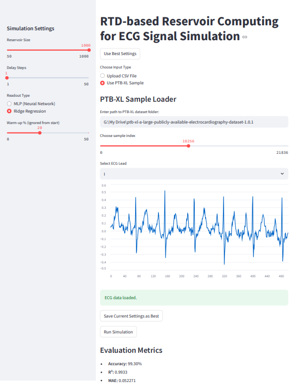
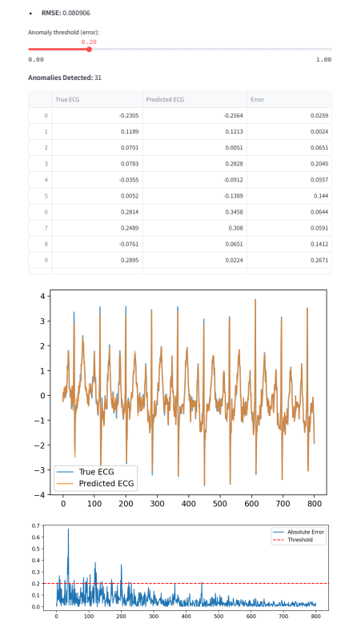
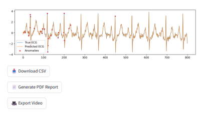

# RTD-Based Reservoir Computing for ECG Signal Simulation

> ⚠️ **This repository contains academic research code provided under the [MIT License](LICENSE).**

## 🧠 Project Overview

This project demonstrates a **nonlinear time-series modeling approach** for ECG signals using a multi-RTD (Resonant Tunneling Diode) inspired **Reservoir Computing (RC)** framework. It is designed as a potential master's thesis topic or educational showcase combining:

- Neuromorphic computing concepts
- Signal processing for biomedical data
- Streamlit for simulation interface
- Python/ML stack (scikit-learn, pandas, matplotlib)

> **Keywords:** Reservoir Computing, RTD, ECG Prediction, MLP/Ridge Readout, Time Series, Biomedical Signal Simulation

---

## 📈 Motivation

Electrocardiogram (ECG) signal prediction is a critical task in biomedical diagnostics. Traditional ML approaches require heavy feature engineering and large datasets.

Reservoir Computing (RC) offers:

- Rapid convergence
- High performance on chaotic/time-dependent systems
- Compatibility with analog/hardware implementations via RTDs

We propose a model that uses **multiple parallel reservoirs** (emulating RTDs) to capture rich temporal dynamics.


## 🧪 Methodology

The main simulation pipeline:

```
Raw ECG ➝ Normalize ➝ [RTD Reservoir 1]
                        ➝ [RTD Reservoir 2]   ➝ Concatenate ➝ MLP/Ridge ➝ Predict ECG
                        ➝ [RTD Reservoir 3]
```

Each RTD unit applies a nonlinear transformation with leaky integration and delay. Their states are concatenated and passed to a trainable readout.


## 🧮 Mathematical Formulation

Reservoir state update per unit:

$$
\mathbf{x}_t = (1 - \alpha) \mathbf{x}_{t-1} + \alpha \cdot \tanh(\mathbf{W}_{in} u_{t-d})
$$

Readout:

- **MLP:** Multi-layer Perceptron with backpropagation
- **Ridge Regression:** \( \mathbf{W}_{out} = (X^TX + \lambda I)^{-1} X^T Y \)

Prediction:

$$
\hat{y}_t = \mathbf{W}_{out} \cdot \mathbf{x}_t
$$


## 📊 Sample Results

| Metric       | Value    |
|--------------|----------|
| **Accuracy** | 99.46%   |
| **R² Score** | 0.9948   |
| **MAE**      | 0.0453   |
| **RMSE**     | 0.0724   |
| **MAPE**     | 3.10%    |


## 🖥️ GUI Interface (Streamlit)

- Upload CSV or load PTB-XL/MIT-BIH samples
- Adjust reservoir size, delay, warm-up %
- Select readout type: MLP or Ridge
- Visualize predicted vs true ECG
- Plot errors and detected anomalies
- Export PDF + Video + CSV

### Screenshots







---

## 📂 Project Structure

```bash
├── main.py                  # Streamlit frontend
├── reservoir.py             # Core reservoir class
├── ecg_loader.py            # Data normalization + loading
├── utils.py                 # Plotting, video, and exports
├── requirements.txt         # All dependencies
├── README.md                # This document
└── /images
    ├── 001.png
    ├── 002.png
    └── 003.png
```


## 📚 Potential Extensions

- Implement hardware-in-the-loop with RTD chips
- Benchmark on multiple biomedical datasets
- Add support for chaotic forecasting (EEG, respiration)
- Publish as an educational tool or web service


## 📘 References

1. Jaeger, H. (2001). *The "echo state" approach to analysing and training recurrent neural networks.* GMD Report 148.
2. Appeltant, L., et al. (2011). *Information processing using a single dynamical node as complex system.* Nature Communications.
3. Goldberger AL, et al. (2000). *PhysioBank, PhysioToolkit, and PhysioNet.* Circulation.


## 🧑‍🎓 Thesis Suitability

This project is highly suitable for:

- MSc in Artificial Intelligence / Biomedical Engineering
- Students aiming to bridge hardware-inspired computing + machine learning
- Explorers of interpretable, low-power AI in health care

---

## 📌 How to Run

```bash
pip install -r requirements.txt
streamlit run main.py
```

---

## ⚖️ License

This project is distributed under the terms of the [MIT License](LICENSE).

---

> Built with ❤️ for education and signal understanding.

---
